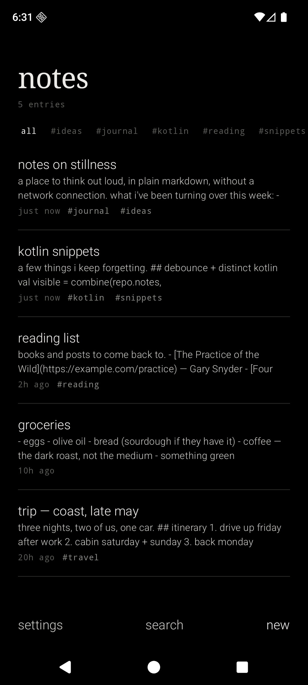
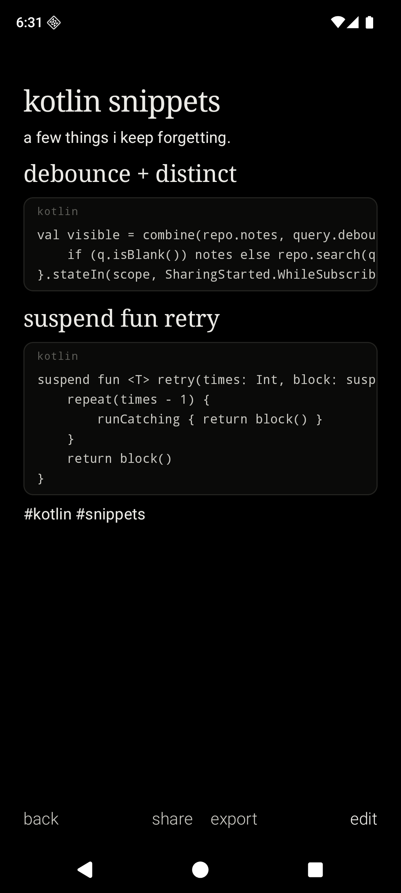
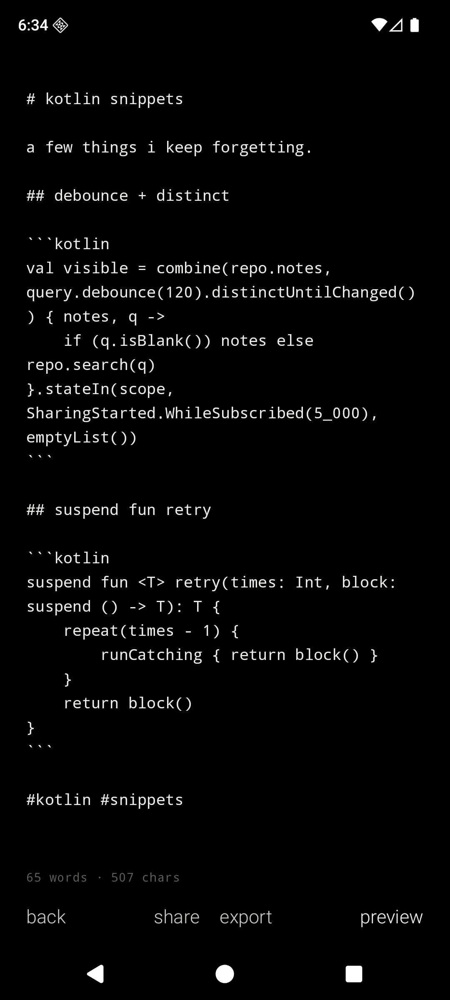
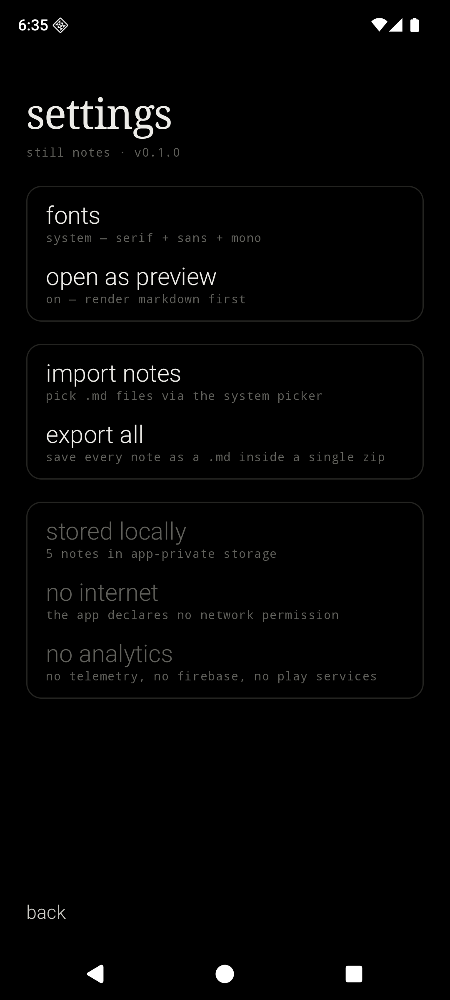

<div align="center">

# Still Notes

#### A quiet markdown notebook for Android.

<br>

&nbsp;&nbsp;&nbsp;

<br>

</div>

---

Still Notes is a minimalist, privacy-first Android notebook. It is monochrome, OLED-first, text-first, and designed to feel like the notes app a beautiful dumb phone would ship if it had a keyboard. It is the companion to [Still](../still-launcher) — same temperament, same fonts, same refusal to phone home.

It declares no internet permission. It ships no analytics. It depends on neither Firebase nor Google Play Services. Notes are plain `.md` files in app-private storage, parsed by an in-house markdown renderer — no third-party markdown library. It runs on any Android device from API 26 up.

## What Still Notes does

- A reverse-chronological list of notes, pinned ones floating to the top, each row showing **title, snippet, relative time, and inline `#tags`**.
- Per-note **edit** and **preview** modes. Edit is raw markdown in a monospace editor with a live word and character count. Preview renders the same text into headings, paragraphs, lists, blockquotes, and fenced code blocks.
- A small in-house markdown renderer covers `# ## ###` headings, paragraphs with `**bold**`, `*italic*`, `` `inline code` ``, `[links](url)`, bullet and ordered lists, blockquotes, horizontal rules, and fenced ```` ``` ```` code blocks with optional language hints, hairline border, monospace body, and horizontal scroll for long lines.
- **Tags are markdown.** Anywhere you write `#word` in a note, it becomes a tag. The list shows a horizontal tag row at the top — tap one to filter the list to notes that mention it. No separate tag manager, no folder hierarchy.
- **Search across the index** by title, body, or tag. One sentence and the list narrows.
- **Long-press a code block to copy it** to the clipboard. **Tap a link** in preview to open it in your browser. (Still Notes itself has no `INTERNET` permission — the URL is handed to the system to resolve.)
- **Import and export** through the Storage Access Framework: pick `.md` files into the notebook, save a single note out as `.md`, or save the entire notebook as one `.zip` of `.md` files. No app-defined storage location, no provider — the system file picker decides where the bytes land.
- **Share in and share out.** Other apps can send text to Still Notes via the Android share sheet (`text/plain`); a single note can be shared out the same way.
- Font presets shared with Still launcher: **System** (serif + sans + mono), **Editorial** (Cormorant + Inter + Plex), **Terminal** (Plex Mono throughout), **Grotesk** (Instrument Serif + Space Grotesk).
- A **preview-by-default** toggle. New notes always open in edit mode; existing notes open in whichever mode you prefer.

## Markdown, deliberately small

The renderer is hand-written and intentionally narrow. It supports the markdown features you actually reach for in a note — headings, emphasis, lists, blockquotes, links, code — and stops there. There is no table support, no footnote support, no syntax highlighting, no math, no embedded HTML. Code blocks are styled, not colored: monospace, hairline border, and horizontal scroll. Consistency with the launcher's monochrome aesthetic was the point.

Block parsing and inline parsing are split into two files (`MarkdownBlocks.kt` and `MarkdownInline.kt`) and dispatched into Compose primitives by `MarkdownText.kt`. Preview mode renders one block per `LazyColumn` item, which lets each fenced code block host its own horizontal scroller without losing gestures to the page's vertical scroll.

The corollary: notes are portable. A folder of `.md` files dropped into another markdown editor, a static-site generator, or `cat` will look the same as in Still Notes — there is no proprietary dialect.

## What Still Notes refuses to do

- No `INTERNET` permission.
- No analytics, no telemetry, no Firebase, no Google Play Services, no ads.
- No cloud backup of notes — `data_extraction_rules.xml` excludes every domain.
- No third-party markdown library. No syntax highlighter pulling in a tokenizer per language. No rich-text controls. No `+` buttons. No branding.
- No notification listener, no accessibility service, no foreground service. The app is doing nothing while it is closed.

## Privacy posture, in code

| File | What it guarantees |
| --- | --- |
| `app/src/main/AndroidManifest.xml` | No permissions declared; only two intent-filters (`MAIN/LAUNCHER` and `SEND` for `text/plain` shares in) |
| `app/src/main/res/xml/data_extraction_rules.xml` | Excludes every sharedpref / file / database domain from cloud backup and device transfer |
| `app/build.gradle.kts` | Dependencies only on AndroidX, Compose, and DataStore — no Firebase, no GMS, no analytics SDK, no markdown library |

## Architecture

```text
MainActivity
└── StillNotesApp                          single-Activity Compose shell, hand-rolled router
    ├── NotesRepository                    .md files on disk + JSON index, debounced autosave
    ├── PreferencesRepository              DataStore — font preset, preview-by-default
    ├── IoActions                          SAF read/write, share-intent builder, .zip export
    ├── Markdown
    │   ├── MarkdownBlocks                 block-level parser (headings, lists, code fences, …)
    │   ├── MarkdownInline                 inline parser (bold, italic, code, links, tags)
    │   └── MarkdownText                   Compose dispatch — one block per LazyColumn item
    └── Compose surfaces
        ├── NotesListScreen                reverse-chrono list, pinned-first, tag filter row, search
        ├── NoteScreen                     edit / preview toggle, footer with word + char count
        └── SettingsScreen                 fonts, preview-by-default, import, export, privacy
```

Kotlin, Jetpack Compose, AGP 9.2.1, Gradle Kotlin DSL. Notes are stored as `<uuid>.md` in `filesDir/notes/` plus a single `index.json` for fast list rendering. Navigation Compose is intentionally avoided; a small sealed-class router lives in `StillNotesApp.kt`. Index entries are encoded as JSON via `org.json` (no extra serialization dependency). Export, bulk export, and import all go through `ActivityResultContracts` — Still Notes never holds a `Uri` past the system picker callback.

## Gestures

| Gesture | Effect |
| --- | --- |
| Tap a note | Open it (in preview or edit, per setting) |
| Long-press a note | Action sheet — pin, share, export, delete |
| Tap a tag in the filter row | Narrow the list to notes that mention that tag |
| Tap `search` in the list footer | Filter the list as you type |
| Tap `edit` / `preview` in the note footer | Toggle modes |
| Long-press a code block | Copy its contents to the clipboard |
| Tap a link in preview | Hand the URL to the system browser |

## Design language

- OLED black background. Soft white primary text. Gray secondary text. Hairline dividers.
- Serif for titles. Sans-serif for body and menu items. Monospace for code, kickers, and captions.
- Lowercase for verbs (`new`, `search`, `share`, `export`, `cancel`, `back`). Title case only when the user typed it themselves.
- No ripple. Fade-only transitions. No bouncy motion, no colorful accents.
- Open-source fonts shipped under their respective OFL licenses: IBM Plex Mono, Inter, Cormorant Garamond, Instrument Serif, Space Grotesk. Drop-in replacements live in `app/src/main/res/font/` and wire through `StillTypography.kt`.

## Build and install

Requirements: **JDK 17**, the **Android SDK** with `platforms;android-36` and `build-tools;36.0.0`. The Gradle wrapper (9.4.1) is bundled.

```bash
./gradlew assembleDebug
adb install -r app/build/outputs/apk/debug/app-debug.apk
```

The app appears as **still notes** in the launcher (or, if you're using [Still](../still-launcher), in the all-apps list).

## Notes for GrapheneOS

Still Notes depends on no part of Google Play Services and declares no permissions, so it runs cleanly on a fresh GrapheneOS profile. SAF import/export uses the system documents UI, so where notes are written on disk depends on your storage scope policy — Still Notes never asks for `MANAGE_EXTERNAL_STORAGE` or any media permission.

## Status

MVP. Builds against AGP 9.2.1 / Kotlin 2.3.21 / `compileSdk 36`. Verified end-to-end on a Pixel 8a Android 36 AOSP emulator: list, create, edit/preview toggle, debounced autosave, pin/delete, tag parsing, tag-filter row, search, single-note SAF export, bulk `.zip` SAF export, multi-pick `.md` import, share-into-app via `ACTION_SEND`, share-out via chooser, long-press-to-copy on code blocks, tap-to-open on links, word and character count, all four font presets, system bar insets. Not yet daily-driven on hardware. The screenshots above are real, not mockups.

## License

MIT. See [`LICENSE`](LICENSE).
